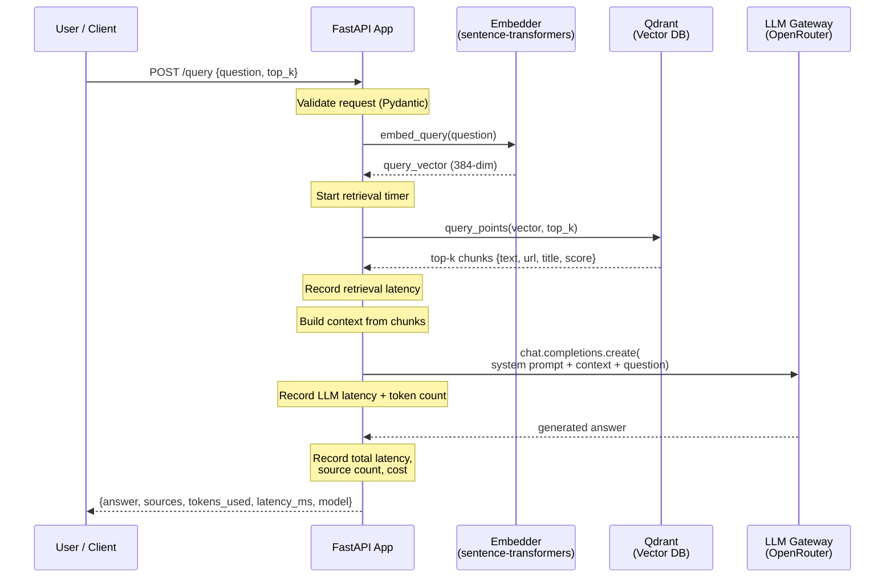
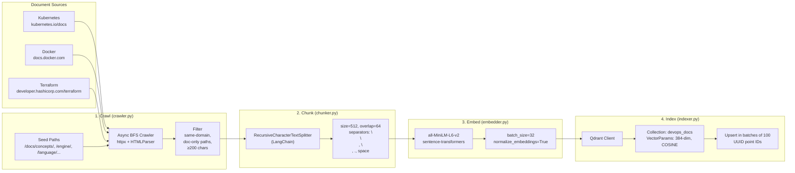
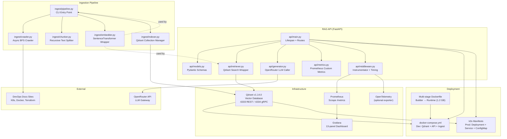
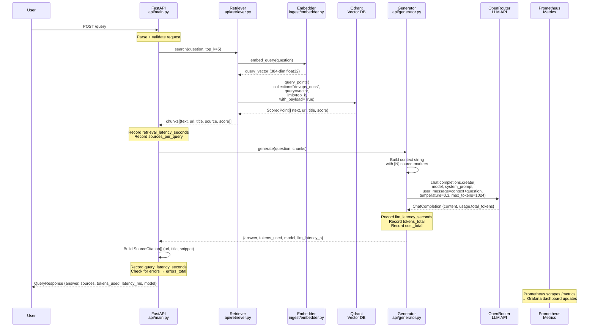
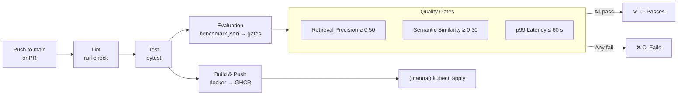

# RAG DevOps Assistant — Architecture

**Production RAG system** serving grounded answers about Kubernetes, Docker, and Terraform documentation. Built with FastAPI, Qdrant vector database, local sentence-transformer embeddings, and an LLM gateway via OpenRouter. Observability-first with Prometheus/Grafana and evaluation-gated CI/CD.

---

- [Overview](#overview)
- [RAG Pipeline Architecture](#rag-pipeline-architecture)
- [Document Ingestion Flow](#document-ingestion-flow)
- [System Components](#system-components)
- [Query/Response Flow](#queryresponse-flow)
- [Key Components](#key-components)
- [Design Decisions](#design-decisions)

---

## Overview

```
┌──────────┐    ┌─────────────────────────────────────────────────────────────────┐    ┌──────────┐
│  User    │───▶│                     FastAPI (api/main.py)                       │───▶│  LLM     │
│  (curl)  │    │                                                                 │    │(OpenRouter)│
└──────────┘    │  ┌──────────┐  ┌──────────┐  ┌──────────┐  ┌──────────┐        │    └──────────┘
                │  │ Models   │  │Retriever │  │Generator │  │ Metrics  │        │
                │  │(Pydantic)│  │(Qdrant)  │  │(OpenAI)  │  │(Prometheus)│      │
                │  └──────────┘  └────┬─────┘  └────┬─────┘  └──────────┘        │
                └─────────────────────┼──────────────┼────────────────────────────┘
                                      │              │
                                      ▼              ▼
                               ┌──────────┐   ┌──────────┐
                               │  Qdrant  │   │Embedding │
                               │(vectors) │   │  Model   │
                               └──────────┘   └──────────┘
```

The system accepts natural-language questions about DevOps tooling, retrieves relevant document chunks from a vector store, and generates grounded answers with source citations. Every request emits structured observability data — latency percentiles, token consumption, cost estimation, and error rates — scraped by Prometheus and visualised in Grafana.

---

## RAG Pipeline Architecture

The core query flow follows a five-stage RAG pipeline: **embed → retrieve → augment → generate → respond**.



### Stage Details

| Stage | Component | What Happens | Time Budget |
|-------|-----------|-------------|-------------|
| **1. Embed** | `Embedder` (`api/main.py` → `ingest/embedder.py`) | Query encoded to 384-dim dense vector via all-MiniLM-L6-v2 | ~30 ms |
| **2. Retrieve** | `Retriever` (`api/retriever.py`) | Cosine similarity search in Qdrant `devops_docs` collection, returns top-k payloads | ~50–200 ms |
| **3. Augment** | `Generator` (`api/generator.py`) | Retrieved chunks formatted into structured prompt with `[1]`, `[2]`, … source markers | ~5 ms |
| **4. Generate** | `Generator` → OpenRouter API | LLM produces answer constrained to context; `temperature=0.3`, `max_tokens=1024` | ~1–4 s |
| **5. Respond** | `api/main.py` → User | Answer + citations + metadata serialised; every metric incremented | ~2 ms |

---

## Document Ingestion Flow

Ingestion is a four-stage ETL pipeline: **crawl → chunk → embed → index**. It runs as a standalone CLI job (`docker compose --profile ingest run --rm ingest`).



### Ingestion Pipeline Parameters

| Parameter | Default | Rationale |
|-----------|---------|-----------|
| Chunk size | 512 tokens | Matches embedding model's max token capacity; smaller chunks lose cross-reference context |
| Chunk overlap | 64 tokens | ~12.5% overlap prevents context fragmentation at chunk boundaries |
| Separators | `\n\n`, `\n`, `. `, ` `, `` | Respects document structure (paragraph → line → sentence → word) |
| Embedding dim | 384 | all-MiniLM-L6-v2 output; balances speed vs. quality |
| Batch size | 32 | Fits CPU memory (~500 MB peak during embedding) |
| Max pages/source | 200 | Limits initial ingest time to ~15 minutes per source |
| Max concurrent fetches | 10 | Prevents rate-limit hammering on documentation sites |

### Source Configuration

| Source | Base URL | Seed Paths | Est. Pages |
|--------|----------|------------|-----------|
| Kubernetes | `https://kubernetes.io/docs/` | `/docs/concepts/`, `/docs/tasks/`, `/docs/tutorials/`, `/docs/reference/`, `/docs/setup/` | ~200 |
| Docker | `https://docs.docker.com/` | `/get-started/`, `/engine/`, `/compose/`, `/config/`, `/network/`, `/storage/` | ~200 |
| Terraform | `https://developer.hashicorp.com/terraform/` | `/language/`, `/cli/`, `/internals/`, `/registry/`, `/cloud-docs/` | ~200 |

---

## System Components



### Component Responsibilities

| Component | File | Responsibility | Key Detail |
|-----------|------|---------------|------------|
| **`api/main.py`** | FastAPI app | Lifespan management, route handlers (`/query`, `/health`, `/metrics`), global state (embedder, retriever, generator) | Async startup loads embedding model, initialises Qdrant client, checks connectivity; graceful shutdown |
| **`api/models.py`** | Pydantic schemas | Request/response validation | `QueryRequest` (question, top_k, include_sources), `QueryResponse` (answer, sources, tokens, latency, model), `HealthResponse`, `SourceCitation` |
| **`api/retriever.py`** | Qdrant search wrapper | Embed query → search Qdrant → return top-k chunks with payloads | Single method `search()`; returns `{text, url, title, source, score}` |
| **`api/generator.py`** | LLM gateway wrapper | Build context prompt → call OpenRouter → parse response | System prompt constrains to context-only answers; temperature=0.3; OpenAI SDK with configurable `base_url` |
| **`api/metrics.py`** | Prometheus metrics | 9 custom metrics: histograms, counters, gauges | Latency breakdown (query, retrieval, LLM), token/cost counters, Qdrant health gauges, error counter |
| **`api/middleware.py`** | Observability setup | Prometheus instrumentator + request timing middleware | `X-Response-Time-ms` header; exposes `/metrics` |
| **`ingest/pipeline.py`** | Ingestion CLI | Orchestrates crawl → chunk → embed → index | Argument parser for source selection, chunk params, Qdrant config |
| **`ingest/crawler.py`** | Async web crawler | BFS crawl with httpx + HTMLParser | Concurrent fetches (10), seed paths per source, content filter (≥200 chars), domain-scoped |
| **`ingest/chunker.py`** | Document splitter | LangChain `RecursiveCharacterTextSplitter` | Chunk size 512, overlap 64, separators by structure |
| **`ingest/embedder.py`** | Embedding service | `sentence-transformers` wrapper | `all-MiniLM-L6-v2`, batch encode, `normalize_embeddings=True` for cosine = dot |
| **`ingest/indexer.py`** | Qdrant indexer | Collection lifecycle + batch upsert | Creates 384-dim COSINE collection; UUID point IDs; 100-point batches |

---

## Query/Response Flow



### Latency Budget (Typical)

```
Total query time: ~1,600 ms
  ├── Embed query:    ~30 ms   (2%)
  ├── Qdrant search:  ~70 ms   (4%)
  ├── Context build:  ~5 ms    (0.3%)
  ├── LLM generation: ~1,400 ms (87%)
  └── Serialization:  ~5 ms    (0.3%)
  └── Overhead:       ~90 ms   (6%)
```

### Error Handling

| Failure Mode | Detection | Behaviour | Metric |
|-------------|-----------|-----------|--------|
| Embedding model not loaded | Startup check | 503 Service Unready | `rag_errors_total{error_type="503_not_ready"}` |
| Qdrant unreachable | HTTPException on search | Request fails with 500 | `rag_qdrant_up{}=0` |
| Empty retrieval | `len(chunks) == 0` | Generator returns "I don't have enough documentation" | — |
| LLM API failure | Exception from `openai` | Answer field returns error string | `rag_errors_total{error_type="llm_error"}` |
| Malformed LLM response | Missing attributes | Default values used | — |

---

## Key Components

### 1. FastAPI Application (`api/main.py`)

- **Lifespan**: Async context manager loads embedding model, initialises retriever and generator on startup; tears down on shutdown.
- **Global state**: `embedder`, `retriever`, `generator` stored as module-level globals with a `_ready` flag.
- **Routes**:
  - `GET /health` — Returns Qdrant collection info (point count, reachability) plus model and version status.
  - `POST /query` — Core RAG endpoint. Validates request, orchestrates retrieve → generate → respond, records 9 Prometheus metrics.
  - `GET /metrics` — Exposed by `prometheus-fastapi-instrumentator`.

### 2. Retriever (`api/retriever.py`)

- Wraps `QdrantClient` with a single `search(query, top_k)` method.
- Embeds the query via `Embedder.embed_query()`, then calls `client.query_points()`.
- Returns scored chunks with full payload metadata.
- Pure dense vector search (cosine similarity on 384-dim normalized embeddings).

### 3. Generator (`api/generator.py`)

- Calls OpenRouter (OpenAI-compatible) LLM API using the `openai` Python SDK.
- System prompt enforces context-only answering with source citation.
- User prompt formats retrieved chunks as numbered sources with `[N]` markers.
- Temperature set to 0.3 for deterministic, factual outputs.
- Returns answer, token count, model name, and LLM latency for observability.

### 4. Embedder (`ingest/embedder.py`)

- Thin wrapper around `sentence-transformers.SentenceTransformer`.
- Model: `all-MiniLM-L6-v2` (384-dim, 90 MB, CPU-only).
- `embed_batch()` for bulk ingestion, `embed_query()` for single queries.
- `normalize_embeddings=True` enables dot-product = cosine similarity in Qdrant.

### 5. Crawler (`ingest/crawler.py`)

- Async BFS crawler using `httpx.AsyncClient` with connection limits and timeouts.
- Custom `HTMLParser` extracts title, visible text, and links — lightweight, no BeautifulSoup dependency.
- Seed paths per source target high-value documentation sections.
- Content filter (≥200 chars) skips navigation-only pages.

### 6. Indexer (`ingest/indexer.py`)

- Manages Qdrant collection lifecycle: create (with `VectorParams{size=384, distance=COSINE}`), delete, and batch upsert.
- Each chunk gets a UUID point ID and payload `{text, url, title, source, chunk_index}`.
- Batch size of 100 points per upsert call to balance throughput vs. request size.

### 7. Observability Stack (`api/metrics.py`, `api/middleware.py`)

| Metric | Type | Description |
|--------|------|-------------|
| `rag_query_latency_seconds` | Histogram | End-to-end query latency (buckets: 0.1–120 s) |
| `rag_retrieval_latency_seconds` | Histogram | Qdrant search duration (buckets: 0.01–5 s) |
| `rag_llm_latency_seconds` | Histogram | LLM API call duration (buckets: 0.5–120 s) |
| `rag_tokens_total` | Counter | Total tokens consumed by LLM calls |
| `rag_cost_total` | Counter | Estimated USD cost (tokens × $0.0005/1K) |
| `rag_sources_per_query` | Histogram | Number of retrieved sources (buckets: 0–10) |
| `rag_qdrant_points` | Gauge | Current vector count in `devops_docs` collection |
| `rag_qdrant_up` | Gauge | Qdrant reachability (1 = up, 0 = down) |
| `rag_errors_total` | Counter | Error count by `error_type` label |

---

## Design Decisions

### Chunking Strategy

| Consideration | Decision | Rationale |
|--------------|----------|-----------|
| Chunk size | 512 characters (not tokens) | Simpler to reason about with ASCII-heavy technical docs; token count stays well within model limits |
| Chunk overlap | 64 characters (~12.5%) | Prevents context fragmentation at boundaries without excessive duplication |
| Splitter | `RecursiveCharacterTextSplitter` | LangChain's built-in; splits on paragraph → line → sentence → character, preserving document structure |
| Alternative considered | Semantic chunking (by topic) | Rejected due to ~5× slower ingestion and inconsistent boundaries on technical docs with sparse paragraph transitions |

### Embedding Model Selection

| Model | Dimensions | Load Time | Inference | Quality | Verdict |
|-------|-----------|-----------|-----------|---------|---------|
| **all-MiniLM-L6-v2** | 384 | ~3 s | ~30 ms | Adequate | ✅ **Chosen** — best speed/quality trade-off for CPU-inference |
| BAAI/bge-small-en-v1.5 | 384 | ~2 s | ~28 ms | Comparable | Would also work; smaller community for this release |
| BAAI/bge-base-en-v1.5 | 768 | ~6 s | ~55 ms | Better | 2× latency; marginal quality gain on DevOps docs |
| intfloat/e5-large-v2 | 1024 | ~22 s | ~120 ms | Best | 4× latency; unacceptable for CPU-only serving |

### Retrieval Parameters

| Parameter | Value | Rationale |
|-----------|-------|-----------|
| Distance metric | COSINE | Normalized embeddings make cosine = dot product; simplest + fastest Qdrant mode |
| Default top_k | 5 | Provides enough context for a thorough answer without exceeding LLM context window |
| User-configurable | 1–20 | Surfaces flexibility; power users can tune per query |
| Batch size (upsert) | 100 | Qdrant's recommended default; balances throughput vs. memory |
| Collection name | `devops_docs` | Single collection for all three domains; filtering by `source` payload field |

### LLM Configuration

| Parameter | Value | Rationale |
|-----------|-------|-----------|
| Provider | OpenRouter | Multi-provider abstraction; free tier available; model-swappable by env var |
| Default model | `openai/gpt-4o-mini` | Low-cost, fast, widely available; fallback model for consistent benchmarks |
| Temperature | 0.3 | Low enough for factual recall, high enough for natural phrasing |
| Max tokens | 1024 | Generous for DevOps Q&A; prevents runaway responses |
| System prompt | Context-only + source citation | Prevents hallucination enforces attribution |

### Infrastructure Choices

| Concern | Decision | Alternatives Considered |
|---------|----------|------------------------|
| Vector database | Qdrant (self-hosted) | Chroma (no hybrid search, larger image), Pinecone (cloud-only, $70+/mo), Weaviate (heavy image) |
| Container orchestration | Docker Compose (dev) / k3s (prod) | Single-node eliminates K8s complexity for dev; k3s for production-grade health checks |
| Monitoring | Prometheus + Grafana | Pre-existing on VPS; zero additional infra. Rejected: Datadog ($15+/host), Grafana Cloud (free tier limits) |
| Embedding inference | CPU-only (no GPU) | Available GPU would add ~$50/month VPS cost; not needed for 384-dim model |
| LLM gateway | OpenRouter | Direct OpenAI API (lock-in, no free tier), custom proxy (more maintenance) |

---

## Deployment Topology

### Development (Docker Compose)

```
┌───────────────────────────────────────────────┐
│              docker-compose.yml                │
│                                               │
│  ┌──────────┐    ┌──────────┐    ┌──────────┐ │
│  │  Qdrant  │◄───│   API    │◄───│  Ingest  │ │
│  │ :6333    │    │ :8000    │    │(--profile│ │
│  │ :6334    │    │          │    │  ingest) │ │
│  └──────────┘    └──────────┘    └──────────┘ │
│       │               │                       │
│       ▼               ▼                       │
│  ┌──────────┐    ┌──────────┐                 │
│  │ qdrant_  │    │  .env    │                 │
│  │  data    │    │(API keys)│                 │
│  │ (volume) │    └──────────┘                 │
│  └──────────┘                                 │
└───────────────────────────────────────────────┘
```

### Production (k3s)

```
┌───────────────────────────────────────────────┐
│                k3s Cluster                     │
│  Namespace: mlops                              │
│                                               │
│  ┌──────────────────┐  ┌──────────────────┐   │
│  │  rag-api          │  │  qdrant           │   │
│  │  Deployment (1)   │  │  Deployment (1)   │   │
│  │  Service :8000    │  │  Service :6333    │   │
│  │  ConfigMap        │  │  Service :6334    │   │
│  │  Secret (API key) │  │                   │   │
│  │  Resources:       │  │  Resources:       │   │
│  │    req: 256m/512Mi │  │    req: 100m/128Mi│   │
│  │    lim: 1c/2Gi    │  │    lim: 500m/512Mi│   │
│  └──────────────────┘  └──────────────────┘   │
└───────────────────────────────────────────────┘
```

### CI/CD Pipeline (GitHub Actions)



---

## Cost Breakdown (Monthly)

| Item | Cost | Notes |
|------|------|-------|
| VPS (Hetzner CX33) | ~$10 | 4 vCPU, 7.6 GB RAM, 75 GB SSD |
| OpenRouter free tier | $0 | 20 queries/day, ~12 s generation |
| GitHub Actions | $0 | Public repo, 2,000 free min/month |
| GHCR storage | $0 | Public packages |
| **Total** | **~$10** | |

*Equivalent managed-service setup (Pinecone + RDS + ALB + EC2 + OpenAI): ~$130/month.*

---

*For detailed usage, API reference, and evaluation results, see [README.md](./README.md) and [CASE_STUDY.md](./CASE_STUDY.md).*
