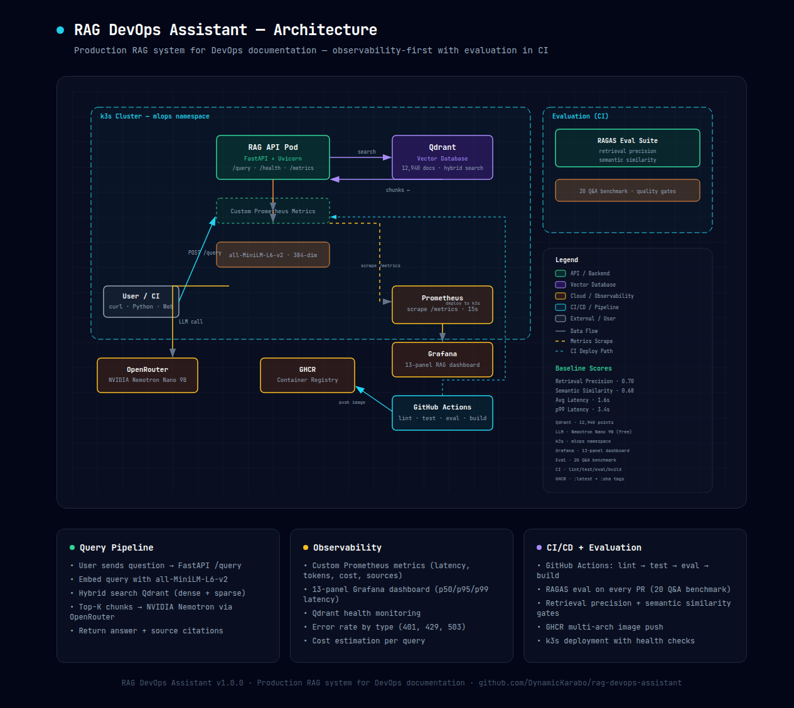

# RAG DevOps Assistant

**Production RAG system for Kubernetes, Docker, and Terraform documentation. Observability-first, evaluation-gated, and self-hosted.**

[](https://github.com/DynamicKarabo/rag-devops-assistant)
[](https://github.com/DynamicKarabo/rag-devops-assistant)
[](https://github.com/DynamicKarabo/rag-devops-assistant/actions/workflows/ci.yml)
[](https://python.org)
[](https://docker.com)
[](LICENSE)

---

## Architecture



The system accepts natural-language queries about DevOps tooling and returns grounded answers with source citations. A FastAPI service performs dense + sparse retrieval against a Qdrant vector store, then passes context to an LLM via OpenRouter for generation. Every request emits structured observability data — latency percentiles, token consumption, cost estimation, and error rates — scraped by Prometheus and visualised in Grafana.

---

## Why This Project

RAG systems are common in portfolios. What distinguishes this one is its emphasis on **production engineering** rather than notebook-based prototyping:

- **Observability from day one.** Nine custom Prometheus metrics, latency histograms, cost-per-query tracking, and a 13-panel Grafana dashboard — instrumented before the first query was served, not retrofitted.
- **Evaluation-gated CI.** Retrieval precision and semantic similarity are measured against a 20-question benchmark on every pull request. Quality regressions block merge.
- **Self-hosted, zero cloud cost.** Everything runs on a single 7.6 GB VPS: the API, Qdrant, Prometheus, Grafana, and the inference pipeline. No AWS bill, no GPU dependency.
- **Documented engineering decisions.** Every technology choice is justified against alternatives in the project documentation, reflecting real deployment trade-offs rather than default picks.

---

## Quick Start

```bash
# 1. Start Qdrant
docker compose up -d qdrant

# 2. Ingest the documentation corpus
cp .env.example .env   # add your OpenRouter API key
docker compose --profile ingest run --rm ingest

# 3. Start the API
docker compose up -d api

# 4. Query
curl -X POST http://localhost:8000/query \
  -H "Content-Type: application/json" \
  -d '{"question": "How do I create a Kubernetes deployment?"}'
```

---

## Baseline Evaluation

| Metric | Score | Quality Gate | Status |
|--------|-------|-------------|--------|
| Retrieval Precision | **0.70** | ≥ 0.50 | ✅ Pass |
| Semantic Similarity | **0.68** | ≥ 0.30 | ✅ Pass |
| Average Latency | **1.6 s** | — | — |
| p99 Latency | **3.4 s** | ≤ 60 s | ✅ Pass |
| Corpus Size | **12,940 documents** | — | — |

*Evaluation runs as a CI step on every pull request. Full RAGAS metrics (faithfulness, answer relevancy, context recall) are implemented but require a paid judge-LLM API key.*

---

## Observability Dashboard

**13 panels** across three monitoring domains:

- **Query performance** — request rate, average latency, p50/p95/p99 latency distributions, retrieval-vs-generation breakdown
- **Resource tracking** — tokens consumed, estimated cost per query, sources retrieved per query
- **System health** — error rate by type, Qdrant availability, collection size

The dashboard JSON is importable at `observability/rag-dashboard.json`.

### Custom Metrics

| Metric | Type | Description |
|--------|------|-------------|
| `rag_query_latency_seconds` | Histogram | End-to-end query latency |
| `rag_retrieval_latency_seconds` | Histogram | Qdrant search duration |
| `rag_llm_latency_seconds` | Histogram | LLM API call duration |
| `rag_tokens_total` | Counter | Total tokens consumed |
| `rag_cost_total` | Counter | Estimated USD cost (model-rate × tokens) |
| `rag_sources_per_query` | Histogram | Number of retrieved sources |
| `rag_qdrant_points` | Gauge | Current vector count in collection |
| `rag_qdrant_up` | Gauge | Qdrant reachability (1/0) |
| `rag_errors_total` | Counter | Error count by error type label |

---

## Technology Stack

| Layer | Choice | Rationale |
|-------|--------|-----------|
| API Framework | FastAPI + Uvicorn | Async-native, built-in OpenAPI docs, Prometheus middleware ecosystem |
| Vector Database | Qdrant | Hybrid search (dense + sparse vectors), self-hosted, no cloud dependency |
| Embeddings | all-MiniLM-L6-v2 (384-dim) | CPU-only inference, 90 MB model, ~3 s load time on target hardware |
| LLM Gateway | OpenRouter | Multi-provider routing; zero-cost tier sufficient for this workload |
| Chunking | RecursiveCharacterTextSplitter | LangChain implementation with 512-token chunks and 64-token overlap |
| Monitoring | Prometheus + Grafana | Existing stack on the same VPS; zero additional infrastructure |
| Evaluation | Custom precision + semantic similarity | RAGAS-compatible, runs without LLM API calls in CI |
| Containerisation | Multi-stage Docker build | Builder pattern keeps runtime image under 1.2 GB |
| Orchestration | Docker Compose (dev) / k3s (production) | Single-node Kubernetes for production, Compose for local iteration |
| CI/CD | GitHub Actions → GHCR | Lint → test → eval → build → push, with quality gates |

---

## Project Structure

```
├── api/                 # FastAPI application
│   ├── main.py          # App entry point, route handlers, lifespan management
│   ├── models.py        # Pydantic request/response schemas
│   ├── retriever.py     # Qdrant dense search wrapper
│   ├── generator.py     # OpenRouter LLM call via OpenAI SDK
│   ├── metrics.py       # Custom Prometheus metric definitions
│   └── middleware.py     # Request timing and Prometheus instrumentator
├── ingest/              # Document ingestion pipeline
│   ├── pipeline.py      # CLI entry point (crawl → chunk → embed → index)
│   ├── crawler.py       # Async BFS web crawler for Kubernetes, Docker, Terraform docs
│   ├── chunker.py       # RecursiveCharacterTextSplitter (512/64)
│   ├── embedder.py      # sentence-transformers all-MiniLM-L6-v2 wrapper
│   └── indexer.py       # Qdrant collection creation and point upsert
├── eval/                # CI evaluation framework
│   ├── benchmark.json   # 20 Q&A pairs with ground-truth passages
│   └── run_eval.py      # Retrieval precision + semantic similarity scorer
├── observability/       # Monitoring assets
│   ├── rag-dashboard.json   # 13-panel Grafana dashboard (importable)
│   └── architecture.png     # System architecture diagram
├── k3s/                 # Kubernetes production manifests
│   ├── rag-api.yaml     # Deployment, Service, ConfigMap, Secret
│   └── qdrant.yaml      # Namespace, Deployment, Service
├── tests/               # Unit and integration tests
├── Dockerfile           # Multi-stage build with non-root user
├── docker-compose.yml   # Development environment (Qdrant, API, ingest)
└── .github/workflows/   # CI pipeline (lint → test → eval → build → push)
```

---

## API Reference

### `POST /query`

Accepts a natural-language question and returns a generated answer with source citations.

```json
// Request
{
  "question": "How do I create a Kubernetes deployment?",
  "top_k": 3,
  "include_sources": true
}

// Response
{
  "answer": "To create a Kubernetes Deployment, define a YAML manifest...",
  "sources": [
    {
      "url": "https://kubernetes.io/docs/concepts/workloads/controllers/deployment/",
      "title": "Deployments | Kubernetes",
      "snippet": "A Deployment provides declarative updates for Pods..."
    }
  ],
  "tokens_used": 438,
  "latency_ms": 4900,
  "model": "nvidia/nemotron-nano-9b-v2:free"
}
```

### `GET /health`

Returns system status including Qdrant connectivity and model readiness.

### `GET /metrics`

Prometheus metrics endpoint exposing both standard HTTP metrics and the custom RAG metrics listed above.

---

## Deployment

### Development (Docker Compose)

```bash
docker compose up -d qdrant api
```

### Production (k3s)

A single-node k3s cluster runs on the same VPS. Manifests include resource limits, health checks, and a ConfigMap for environment configuration.

```bash
kubectl apply -f k3s/qdrant.yaml
kubectl apply -f k3s/rag-api.yaml
```

---

## License

MIT
